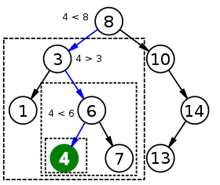

# Logarithm

### Mathematical Definition:
logb(x) = y     iff     by = x

When discussing logarithms, it is important to specify the base. In computer science, we assume the binary logarithm - base 2.

### Mathematical Intuition:  
log2(N) = y      iff     2y = N  
log2(N) = ?      iff     2? = N  
- i.e... log(N) is the power that you need to put 2 to get N  
- thus...  
log(1)=0 ≈≈ 20=1  
log(4)=2 ≈≈ 22=4  
log(8)=3 ≈≈ 23=8  
log(16)=4 ≈≈ 24=16  
log(N)=? ≈≈ 2?=N  

To find the binary logarithm (base 2) of a number N is analogous to asking "2 to the power of what equals N?". When we add 1 to the power of 2, we are doubling the input N.

When considering if an algorithm has a logarithmic complexity, ask yourself:
- Are you eliminating half the input at every step?
- If you double the size of the input, are you only adding one operation?

### Takeaway
As an input value N increases, log(N) will increase at a slower rate - i.e. 2 to 1 for binary logarithms. With regards to computer science and programming algorithms, logarithms express an instance where input values double while computational operations increase by a magnitude of one.

### Examples
- An array of length N, where an algorithm cuts the array in half at each step. This algorithm has a time complexity that roughly maps to log(N). This is seen in binary tree search algorithms.

