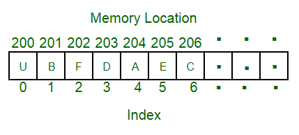

# Array
An array is a collection of items stored at contiguous memory locations. The idea is to store multiple items of the same type together. This makes it easier to calculate the position of each element by simply adding an offset to a base value, i.e., the memory location of the first element of the array (generally denoted by the name of the array).

Arrays can be static or dynamic. Static arrays have a fixed size established when the array is declared. Dynamic arrays can change size as they are pushed more values. Generally dynamic arrays will double in size once a threshold capacity is reached. 

## Complexities

| Access    | Search    | Insertion | Deletion  | Comments  |
| :-------: | :-------: | :-------: | :-------: | :-------- |
| 1         | n         | n         | n         |           |