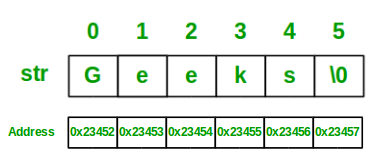

# Strings
Strings are defined as an array of characters. The difference between a character array and a string is the string is terminated with a special character '\0'.

Each character in a string maps to an ASCII encoded integer, with each integer stored as a value in an array. 

Strings are im/mutable depending on the programming language. In JavaScript, if you alter a string, you are actually declaring a brand new string with updated characters.

If lots of manipulation is needed, it is often recommended to break out each string into arrays of characters.

## Complexities

| Access    | Search    | Insertion | Deletion  | Comments  |
| :-------: | :-------: | :-------: | :-------: | :-------- |
| 1         | n         | n         | n         |           |